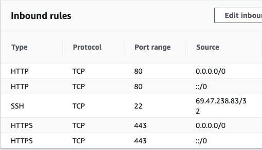

# Deploy Manually

## Backend server

1. ssh in ec2 instance  
   `ssh -i <pem file> ec2-user@<Public IP of the EC2 instance>`
2. checkout branch you want to deploy
3. `pipenv install` if dependencies have changed
4. reload daemon  
   `sudo systemctl daemon-reload`
5. start services  
   `sudo systemctl restart gunicorn && sudo systemctl restart nginx`
6. check status  
   `sudo systemctl status gunicorn`  
   `sudo systemctl status nginx`
7. make sure services started without errors  
   `journalctl -u gunicron.service`
   `journalctl -u nginx`

## Frontend

1. checkout branch you want to deploy locally
2. `yarn deploy`

# AWS Initial Configuration steps

The backend API service is deployed and running on an [AWS EC2 instance](https://docs.aws.amazon.com/AWSEC2/latest/UserGuide/concepts.html). An AWS account is required in order to login to the console (account owner can generate login credentials for new users).
This [Medium Article](https://medium.com/@shefaliaj7/hosting-react-flask-mongodb-web-application-on-aws-part-1-introduction-f49b1be79f48) was helpful to get all of the resources stood up on AWS.

1. Create [Virtual Private Cloud](https://aws.amazon.com/vpc/)
2. Create [Public Subnet](https://docs.aws.amazon.com/vpc/latest/userguide/VPC_Subnets.html)
3. Create [Internet Gateway](https://docs.aws.amazon.com/vpc/latest/userguide/VPC_Internet_Gateway.html)
4. Attach Internet Gateway to VPC
5. Create [Route Table](https://docs.aws.amazon.com/vpc/latest/userguide/VPC_Route_Tables.html)
6. Add routes to Route Table, 0.0.0.0/0, ::0 (accept all internet traffic)
7. Add Subnet Association to Route Table
8. Launch free tier EC2 Instance in the new VPC, and Subnet
9. Configure [Security Group](https://docs.aws.amazon.com/vpc/latest/userguide/VPC_SecurityGroups.html)  
   
10. Launche Instance, Generate key pair, or use an existing key pair  
    these are needed to ssh into the ec2 instance
11. Allocate an [Elastic IP](https://docs.aws.amazon.com/AWSEC2/latest/UserGuide/elastic-ip-addresses-eip.html) to the ec2 instnace
12. SSH into the ec2 instance  
    `ssh -i <pem file> ec2-user@<Public IP of the EC2 instance>`
13. Create [Route53](https://docs.aws.amazon.com/Route53/latest/DeveloperGuide/Welcome.html), added a record to route traffic to the ec2 instance [article](https://docs.aws.amazon.com/Route53/latest/DeveloperGuide/routing-to-ec2-instance.html)
14. The IP address needs to have a domain name in order to route https to the server. I registered the domain name: `osumc-cultural-awareness.com` on freenom.com. You can register a domain name through AWS but freenom offer free domains.

## Provision EC2 instance

Starting from a fresh Amazon Linux 2 instance

- install git  
  `yum -y install git-core`
- install python  
  `sudo yum install python3 python3-devel pip3`
- [install python 3.8](https://tecadmin.net/install-python-3-8-amazon-linux/)
- `sudo make && sudo make install`
- `alias python3=python3.8, pip3=pip3.8`
- `sudo pip3 install pipenv`
- install c compiler (needed to build uWSGI)  
  `sudo yum groupinstall "Development Tools" `
- install nginx  
  `sudo amazon-linux-extras install nginx1.12`  
  \*I had to `chmod 711 /home/ec2-user` to get nginx working
- install cert bot  
  `sudo yum install -y certbot`
- generate cert  
  `sudo certbot certonly`  
  this generates a certificate and a key  
  cert: /etc/letsencrypt/live/www.osumc-cultural-awareness.com/fullchain.pem  
  key: /etc/letsencrypt/live/www.osumc-cultural-awareness.com/privkey.pem  
  \*expires after 2 months
- clone repo
- install python dependencies  
  `pip3 install -r /path/to/requirements.txt`
- create production .env file in app root

```
FLASK_ENV=production
FLASK_APP=api/__main__.py

FRONTEND_URL=https://freeman91.github.io/OSUMC-Cultural-Awareness-App

MONGO_URI='mongodb+srv://ec2-user:<password>@data-cluster.tjzlp.mongodb.net/database?retryWrites=true&w=majority'
MONGO_INITDB_DATABASE=database

GMAIL_ADDRESS=osumc.cultural.awareness@gmail.com
GMAIL_PASSWORD=<password>

SECRET_KEY=<secret_key>
```

- copy gunicorn service file  
  `sudo cp gunicorn.service /etc/systemd/system/gunicorn.service`
- copy nginx.conf file  
  `sudo cp nginx.conf /etc/nginx/nginx.conf`

- reload daemon  
  `sudo systemctl daemon-reload`
- start services  
  `sudo systemctl start gunicorn && sudo systemctl start nginx`
- check status  
  `sudo systemctl status gunicorn`  
  `sudo systemctl status nginx`
- show logs  
  `journalctl -u gunicron.service`
  `journalctl -u nginx`

# Steps to setup GithubPages deployment

[Expo | Publishing websites](https://docs.expo.io/distribution/publishing-websites/)

- Repo settings > GitHub Pages set `branch=gh-pages`, `dir=/(root)`
- `yarn add -D gh-pages`
- in package.json add:

```json
{
  //...
  "homepage": "https://freeman91.github.io/OSUMC-Cultural-Awareness-App/",
  "scripts": {
    //...
    "deploy": "gh-pages -d web-build",
    "predeploy": "expo build:web"
  }
  //...
}
```

- `yarn deploy` bundles the application for production and pushes the generated dir `web-build/` to the `gh-pages` branch. safe to delete web-build/ after deploy
